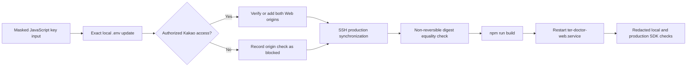

# Design Document: Kakao Map Key Fix

## Overview

This design repairs the Kakao Maps JavaScript SDK configuration without changing application behavior or unrelated settings. The workflow accepts the approved JavaScript key through a masked or otherwise non-echoing input channel, performs exact-key environment-file edits, conditionally checks Kakao Web origins through existing authorized access, synchronizes the confirmed production environment over SSH, rebuilds Next.js, restarts the existing systemd service, and performs redacted browser validation.

The repository already contains the required runtime integration: `components/KakaoMap.tsx` reads `NEXT_PUBLIC_KAKAO_MAP_JS_KEY` and requests `https://dapi.kakao.com/v2/maps/sdk.js` with `autoload=false`. No component change is planned. Production uses `/home/ec2-user/ter-doctor`, `ter-doctor-web.service`, and nginx on the requested DuckDNS host.

### Research findings

- Kakao requires Web service information to be registered against the JavaScript key in the application management settings; therefore origin work requires existing authorized Kakao Developers access and cannot be truthfully completed from repository or SSH access alone ([Kakao Developers](https://developers.kakao.com/docs/latest/en/javascript/getting-started-v1)).
- Next.js replaces browser-facing `NEXT_PUBLIC_` references with build-time values; therefore editing the production environment without a new build cannot repair the active client bundle ([Next.js environment variables](https://nextjs.org/docs/13/app/building-your-application/configuring/environment-variables)).
- Repository inspection shows `npm run build` invokes `next build`, the frontend listens on port 4173, and `ter-doctor-web.service` starts the production Next.js server.

Content was rephrased for compliance with licensing restrictions.

## Architecture



The workflow has four trust boundaries:

1. **Input boundary**: key material enters through masked input or a pre-populated process environment variable and is never placed in task text or command arguments.
2. **Local file boundary**: an exact parser updates one environment assignment while retaining all other bytes or logical values.
3. **Remote boundary**: SSH uses the specified identity and account; remote commands suppress tracing and never print environment-file content.
4. **Browser boundary**: validation reports only origin, HTTP success as a boolean, namespace readiness, and a sanitized failure category.

## Components and Interfaces

### Configuration updater

The updater receives an environment-file path and key through process memory. The updater must locate exactly one active `NEXT_PUBLIC_KAKAO_MAP_JS_KEY` assignment, replace only the assignment value, preserve the remainder of the file, and fail on zero or multiple active assignments. Validation returns booleans for presence and URL-shaped input; validation never returns the key.

### Origin configuration gate

The gate checks for an already-authorized Kakao Developers session or credential mechanism. With authorized access, the gate verifies both Required Origins and appends only missing origins. Without access, the gate emits `blocked: authorization unavailable`; the gate does not create accounts, reset credentials, or infer an application from unrelated keys.

### Production synchronizer

The synchronizer connects to `ec2-user@13.125.18.54` with `/Users/jiwon/security/kb-ai.pem`, confirms `/home/ec2-user/ter-doctor` and the environment file consumed by `npm run build`, applies the same exact update, and compares local and remote SHA-256 digests of only the key values. Output contains only equality status, not either digest or value.
### Build and service controller

The controller runs `npm run build` from `/home/ec2-user/ter-doctor`. Only a successful build permits `sudo systemctl restart ter-doctor-web.service`. A failed build leaves the currently running service untouched. After restart completion, `systemctl is-active ter-doctor-web.service` and an HTTP request to the production origin provide service-level evidence.

### SDK validator

A small Playwright-based validator uses the existing `playwright-core` dependency. For each requested origin, the validator opens a page at that origin, adds the Kakao Maps SDK script from memory, waits for a successful SDK response, calls the SDK loader, and checks `window.kakao.maps`. The validator strips query strings before processing diagnostics and prints only a structured redacted result. A separate build check searches generated client assets for the expected value but returns only a boolean, establishing that the build embedded the synchronized key.

If a local server is not already available, the execution agent asks the user to start `npm run dev:web` manually; the automation does not start a long-running development process.

## Data Models

```ts
type ConfigUpdateResult = {
  pathLabel: "local" | "production";
  assignmentCount: number;
  validShape: boolean;
  protectedSettingsUnchanged: boolean;
};

type OriginCheckResult = {
  origin: "http://127.0.0.1:4173" | "http://jarimaegim.duckdns.org";
  status: "present" | "added" | "blocked" | "failed";
  reason?: "authorization_unavailable" | "update_rejected";
};

type DeploymentResult = {
  keyDigestsMatch: boolean;
  buildSucceeded: boolean;
  serviceActive: boolean;
  productionHttpOk: boolean;
};

type SdkCheckResult = {
  origin: string;
  sdkResponseOk: boolean;
  namespaceReady: boolean;
  embeddedKeyPresent: boolean;
  failureCategory?: "network" | "unauthorized_origin" | "sdk_init" | "build_mismatch";
};
```

No model contains the JavaScript key, SDK URL query string, environment-file content, or reversible representation of key material. Digest values are compared internally and discarded.

## Error Handling

- Reject missing, empty, URL-shaped, duplicate, or ambiguous key assignments before dependent steps.
- Write environment changes through a same-directory temporary file followed by atomic replacement; retain restrictive permissions.
- Capture protected-setting fingerprints before each edit and require equality after each edit. On mismatch, restore the pre-edit file and stop.
- Fail immediately when SSH authentication, host reachability, or production environment discovery fails.
- Do not restart the frontend after a failed production build.
- Treat unavailable Kakao authorization as an explicit blocked origin check, not a successful check. Continue deployment only with the blocked status visible in the final result.
- Treat an SDK HTTP rejection, absent Maps namespace, inactive service, or build mismatch as validation failure.
- Sanitize thrown errors before output by removing query strings, environment assignments, and candidate key text.

## Testing Strategy

Property-based testing is not appropriate because this change consists of narrow environment configuration, external console state, SSH deployment, process control, and browser-side integration checks rather than a broad pure input/output algorithm. The design therefore omits a Correctness Properties section.

Use the following targeted checks:

- **Updater unit checks**: temporary environment fixtures verify exact single-assignment replacement, URL-shaped rejection, duplicate-assignment rejection, byte-preservation of unrelated lines, and redacted output.
- **Local build check**: run `npm run build`, verify success, and return only whether generated client assets contain the expected configured value.
- **Origin integration check**: inspect or update Kakao Developers settings only through existing authorized access; record each required origin as present, added, blocked, or failed.
- **Production deployment check**: verify non-reversible key equality, successful build, completed service restart, active systemd state, and successful production HTTP response.
- **Browser smoke checks**: run the redacted SDK validator once against local and once against production; assert successful SDK response and `window.kakao.maps` readiness.
- **Scope regression check**: compare protected-setting fingerprints and repository changes before and after execution; only the intended ignored environment value and directly related validation tooling may differ.